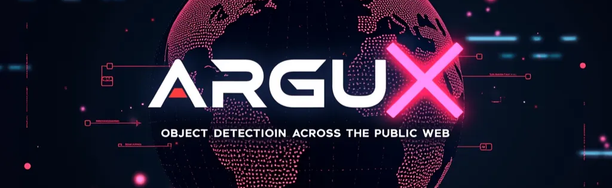
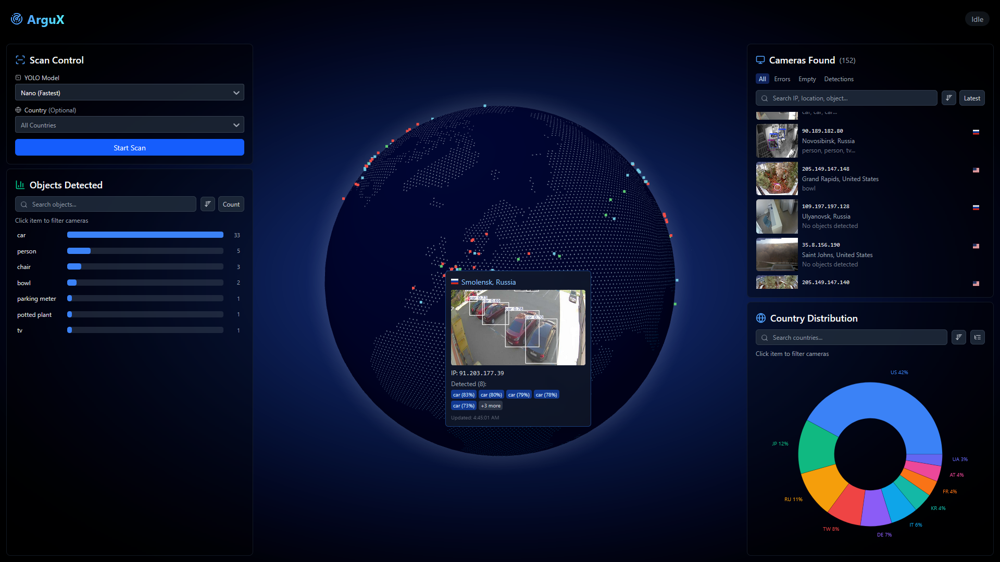
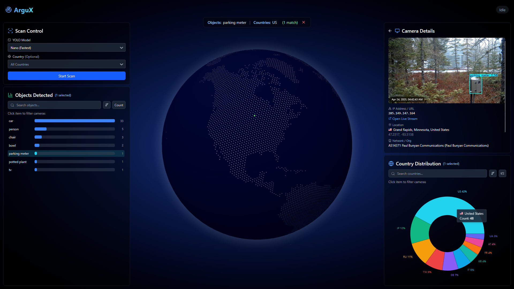
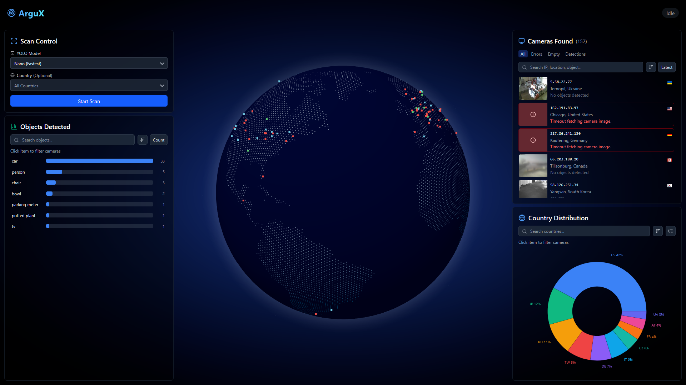

> _Named after Argus Panoptes, the all-seeing giant with a hundred eyes from Greek mythology_

ArguX is an advanced OSINT tool designed for gathering and analyzing publicly available camera feeds. It connects to publicly available sources like Insecam, applies object detection using YOLOv11 models to identify objects such as cars, people, and more, then visualizes the results through an intuitive web interface.

ArguX is a significant evolution from my previous project [EagleEye](https://github.com/erfangolpour/EagleEye), which was a command-line tool using YOLOv4. While EagleEye laid the groundwork, ArguX completely reimagines the concept with a modern architecture, web interface, and significantly expanded functionality.

<div align="center">
  
  <p><em><small>Interactive visualization of camera feeds across the globe</small></em></p>
</div>

## ✨ Features

-   **High Performance Processing**: Utilizes Celery integrated with Redis to efficiently distribute tasks among different threads
-   **Advanced Object Detection**: Provides different sizes of YOLOv11 (nano, small, medium, large) for optimal performance based on your hardware
-   **Easy Setup**: Simple configuration and intuitive user interface
-   **Rich Visualization**: Multiple formats of data visualization (3D globe, charts, lists) with comprehensive filtering and sorting capabilities
-   **Geolocation Analysis**: Fetches and maps geolocation information about camera IPs using ip-api.com
-   **Real-time Results**: WebSocket-based live updates as cameras are analyzed
-   **Flexible Scanning**: Filter camera sources by country or scan globally

<div align="center">
  
  <p><em><small>Comprehensive filtering and sorting options for detected objects</small></em></p>
</div>

## 🛠️ Technologies

ArguX is built using a modern tech stack:

### Backend

-   [FastAPI](https://fastapi.tiangolo.com/) - High-performance API framework
-   [Celery](https://docs.celeryq.dev/) - Distributed task queue
-   [Redis](https://redis.io/) - In-memory data store and message broker
-   [Ultralytics YOLOv11](https://docs.ultralytics.com/models/yolo11/) - State-of-the-art object detection
-   [OpenCV](https://opencv.org/) - Computer vision processing
-   [Beautiful Soup](https://www.crummy.com/software/BeautifulSoup/) - Web scraping

### Frontend

-   [Vite.js](https://vitejs.dev/) - Next generation frontend tooling
-   [React 19](https://react.dev/) - UI framework
-   [TypeScript](https://www.typescriptlang.org/) - Type-safe JavaScript
-   [Three.js](https://threejs.org/) & [react-three-fiber](https://github.com/pmndrs/react-three-fiber) - 3D globe visualization
-   [Recharts](https://recharts.org/) - Charting library
-   [Tailwind CSS](https://tailwindcss.com/) - Utility-first CSS framework
-   [Zustand](https://github.com/pmndrs/zustand) - State management

<div align="center">
  
  <p><em><small>Graceful error handling and detailed feedback</small></em></p>
</div>

## 🚀 Installation

### Prerequisites

-   **Python 3.10+**
-   **Node.js 18+** and npm
-   **Redis** server
-   **Git** (for cloning the repository)

### Backend Setup

1. Clone the repository:

    ```bash
    git clone https://github.com/erfangolpour/argux.git
    cd argux
    ```

2. Set up a Python virtual environment:

    ```bash
    cd backend
    python -m venv .venv
    source .venv/bin/activate  # On Windows: .venv\Scripts\activate
    ```

3. Install Python dependencies:
    ```bash
    pip install -r requirements.txt
    ```

### Frontend Setup

1. Install Node.js dependencies:
    ```bash
    cd frontend
    npm install
    ```

### Redis Setup

1. Install Redis server:

    **On Ubuntu/Debian:**

    ```bash
    sudo apt update
    sudo apt install redis-server
    sudo systemctl enable redis-server
    ```

    **On macOS (using Homebrew):**

    ```bash
    brew install redis
    brew services start redis
    ```

    **For other platforms, please refer to the [Redis documentation](https://redis.io/download).**

## ⚙️ Configuration

### Backend Configuration

The backend settings can be configured in `backend/settings.py`:

-   Adjust Redis connection settings (`redis_host`, `redis_port`, `redis_db`)
-   Configure YOLO model settings (`default_model`, `yolo_base_dir`)
-   Set maximum concurrent tasks (`max_concurrent_tasks`)
-   Modify CORS settings for development/production environments

You can also create a `.env` file in the backend directory to override any settings:

```
LOG_LEVEL=INFO
MAX_CONCURRENT_TASKS=5
DEFAULT_MODEL=yolo11m.pt
```

## 🚀 Running the Application

### Running Services Manually

1. Start the Redis server (if not already running as a service):

    ```bash
    redis-server
    ```

2. Start the Backend API (from the backend directory):

    ```bash
    uvicorn main:app --reload
    ```

3. Start the Celery worker (from the backend directory):

    ```bash
    celery -A main.celery_app worker
    ```

4. Start the Frontend development server (from the frontend directory):
    ```bash
    npm run dev
    ```

### Running with tmux (Linux/macOS)

For convenience, a `run.sh` script is provided that uses tmux to run all services in a single terminal window:

```bash
chmod +x run.sh
./run.sh
```

This will create a tmux session with separate panes for the backend API, Celery worker, and frontend development server.

### Running on Windows

While ArguX is not officially tested on Windows, it should be possible to run with proper configuration:

1. Ensure Redis is installed and running (through WSL or Windows binary)
2. Start each service in a separate command prompt:
    - Backend API: `python -m uvicorn main:app --reload`
    - Celery worker: `celery -A main.celery_app worker --loglevel=info --pool=solo`
    - Frontend: `npm run dev`

## 🔮 Future Directions

ArguX is continuously evolving. Planned features include:

-   **Data Export**: Capability to export results in various formats
-   **Persistent Database**: Storage system for scan results for easy recall and historical analysis
-   **Custom Object Detection**: Add custom objects to the detection model by re-training YOLO
-   **Better Backend-Celery Synchronization**: Improve communication and avoid busy loops
-   **Optional Redis**: Make Redis an optional dependency by allowing Celery to manage threads directly
-   **Additional Sources**: Integration with more camera sources (Shodan, Censys, Criminal IP, ZoomEye, public highway indexes, etc.)

## 💡 Debugging Tools

While not a requirement, [Flower](https://github.com/mher/flower) is an excellent open-source tool for monitoring and managing Celery clusters. To use it:

```bash
pip install flower
celery -A main.celery_app flower
```

This provides a web interface at `http://localhost:5555` for monitoring task execution.

## ⚠️ Limitations and Ethics

### Technical Limitations

It's important to understand that object detection models have inherent limitations. While YOLO is effective at identifying common objects like cars, people, or animals, it has limitations:

-   Even the smallest YOLO models, despite being extremely efficient and fast, still need processing time, especially given the scale at which ArguX operates
-   Detection accuracy is dependent on feed quality, lighting conditions, and distance
-   Results should always be verified by a human

Contrary to popular belief, facial recognition is significantly more demanding than object detection and is simply not feasible at the current resolution of public camera feeds. So to answer the frequently asked question: this tool cannot be used to find specific people.

### Ethical Considerations

ArguX connects to camera feeds that are accessible through public directories like Insecam, which may include:

-   Cameras with default credentials that haven't been changed
-   Improperly secured camera feeds
-   Cameras intentionally made public by their owners

It's important to understand that while these feeds are accessible to the average user through directory websites, this doesn't always mean they were intentionally made public by their owners. When using ArguX:

-   Respect privacy and legal regulations in your jurisdiction
-   Do not use for surveillance or monitoring individuals
-   Do not share or publish content that contains private or sensitive information

As the creator of ArguX, I provide this tool strictly for research and educational purposes. I assume no liability and am not responsible for any misuse, illegal application, or damage caused by ArguX or modified versions of it. Users are solely responsible for ensuring their use of ArguX complies with all applicable laws and ethical standards.

## 🤝 Contributing

Contributions to ArguX are welcome! Please follow these steps:

1. Fork the repository
2. Create a feature branch: `git checkout -b feature/awesome-feature`
3. Commit your changes: `git commit -am 'Add awesome feature'`
4. Push to the branch: `git push origin feature/awesome-feature`
5. Open a Pull Request

Please ensure your code follows the project's coding style and is properly tested.

## 📝 License

ArguX is licensed under the GNU General Public License v3.0 - see the [LICENSE](LICENSE) file for details.

## 🙏 Acknowledgments

-   [Ultralytics](https://github.com/ultralytics/ultralytics) for their incredible YOLO implementation
-   [Insecam](http://www.insecam.org/) for aggregating publicly available camera feeds
-   [ip-api.com](https://ip-api.com/) for providing geolocation data
-   [Celery](https://docs.celeryq.dev/) for the distributed task queue framework
-   [FastAPI](https://fastapi.tiangolo.com/) for the high-performance API framework
-   All the open-source libraries and tools that make ArguX possible
